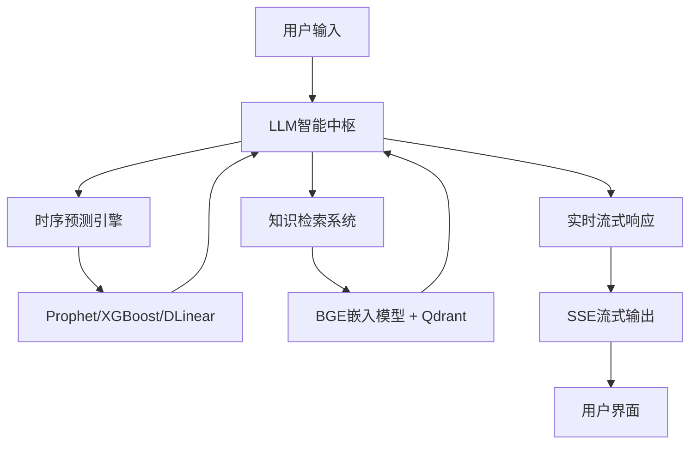

# 小易猜猜 (Xiaoyi) 

<div align="center">


**Make Time Series Forecast Great Again**

*挺能猜的，也挺能说的*  
*Pretty good at forecasting, and explaining*

[](https://xiaoyi.actscal.org)
[](LICENSE)
[](https://github.com/Tarpelite/xiaoyi/stargazers)
[](https://github.com/Tarpelite/xiaoyi/watchers)
[](https://github.com/Tarpelite/xiaoyi/network/members)
[](https://github.com/Tarpelite/xiaoyi/issues)
[](https://github.com/Tarpelite/xiaoyi/pulls)

[](https://www.python.org/)
[](https://fastapi.tiangolo.com/)
[](https://nextjs.org/)
[](https://reactjs.org/)
[](https://www.typescriptlang.org/)
[](https://www.docker.com/)
[](https://github.com/astral-sh/uv)
[](https://pnpm.io/)

[在线演示](https://xiaoyi.actscal.org) · [技术文档](#技术架构) · [快速开始](#快速启动)

</div>

---

## 📖 项目简介

**小易猜猜 (Xiaoyi)** 是一个基于大语言模型驱动的智能时序分析与预测平台。通过结合先进的LLM调度技术、专业时序模型和知识检索系统，为时间序列数据提供深度分析、智能预测和可解释性洞察。

### 🎯 核心能力

#### 📊 **时序分析**
- **智能事件识别**：自动识别历史序列中的关键事件并进行评价
- **关键区间切分**：智能切分重要时间区间，解析态势趋势
- **自适应分析**：对历史时间序列进行深度分析，自动调整分析策略

#### 🔮 **时序预测**
- **前沿模型集成**：基于最新时间预测技术，不只是机械预报
- **预测可解释性**：更能解释预测背后的逻辑和依据
- **多模型融合**：让 LLM 能够"次预测有源可溯"

#### 💡 **智能问答**
- **实时流式响应**：类似ChatGPT的流畅对话体验
- **上下文理解**：支持多轮对话，理解历史上下文
- **知识检索增强**：结合RAG技术提供专业金融知识支持

---

## 🏗️ 技术架构

### 核心架构：LLM调度时序小模型



### 技术栈

#### 后端 (Backend)
- **核心框架**: FastAPI (Python 3.12+)
- **包管理器**: `uv` (高性能依赖管理)
- **LLM集成**: DeepSeek, LangChain
- **时序模型**: Prophet, XGBoost, DLinear
- **知识检索**: BGE嵌入 + Qdrant向量数据库
- **数据存储**: Redis (缓存), MongoDB (持久化)
- **数据来源**: AkShare (金融数据)

#### 前端 (Frontend)
- **核心框架**: Next.js 14 (React 18)
- **包管理器**: `pnpm`
- **UI框架**: Tailwind CSS, Framer Motion
- **图表可视化**: Recharts, ECharts
- **认证系统**: Authing (IDaaS)

#### 实时通信
- **SSE流式传输**: 服务端事件推送
- **Redis消息队列**: 任务异步处理

---

##  快速启动

### 📋 前置要求

| 组件 | 版本要求 | 说明 |
|------|---------|------|
| **Python** | >= 3.12 | 后端运行环境 |
| **Node.js** | >= 18 | 前端运行环境 |
| **Redis** | >= 7.0 | 缓存服务（必需） |
| **MongoDB** | >= 6.0 | 数据持久化（可选） |
| **uv** 或 **conda** | latest | Python包管理器（二选一） |
| **pnpm** | >= 8.0 | 前端包管理器 |

---

### 🔧 环境配置

#### 1. 克隆项目

```bash
git clone https://github.com/your-repo/xiaoyi.git
cd xiaoyi
```

#### 2. 配置环境变量

**后端环境变量** (使用根目录 `.env`):

```bash
# 复制示例文件
cp .env.example .env

# 编辑 .env 文件，填入以下必需配置：
# - DEEPSEEK_API_KEY: DeepSeek API密钥（必需）
# - AUTHING_APP_ID: Authing应用ID（必需）
# - AUTHING_APP_SECRET: Authing应用密钥（必需）
# - AUTHING_ISSUER: Authing OIDC地址（必需）
# - MONGODB_HOST/USERNAME/PASSWORD: MongoDB配置（可选）
# - REDIS_HOST/PORT: Redis配置（默认localhost:6379）
```

**前端环境变量** (创建 `frontend/.env.local`):

```bash
# 复制示例文件
cp frontend/.env.local.example frontend/.env.local

# 前端环境变量会自动从根目录.env读取以下内容：
# - NEXT_PUBLIC_API_URL
# - NEXT_PUBLIC_AUTHING_APP_ID
# - NEXT_PUBLIC_AUTHING_ISSUER
# 等等
```

> **💡 提示**: 开发环境下，前端会读取 `frontend/.env.local`，后端会读取根目录 `.env`

#### 3. 启动Redis（必需）

**方式1: Docker (推荐)**
```bash
docker run -d --name xiaoyi-redis \
  -p 6379:6379 \
  redis:7-alpine redis-server --appendonly yes
```

**方式2: 本地安装**
```bash
# macOS
brew install redis
brew services start redis

# Ubuntu
sudo apt install redis-server
sudo systemctl start redis
```

---

### 🐍 后端启动

#### 方式1: 使用 uv (推荐，极速)

```bash
# 1. 安装 uv（如果未安装）
curl -LsSf https://astral.sh/uv/install.sh | sh

# 2. 进入后端目录
cd backend

# 3. 同步依赖（自动创建虚拟环境）
uv sync

# 4. 启动开发服务器
uv run uvicorn app.main:app --host 0.0.0.0 --port 8000 --reload

# ✅ 后端运行在: http://localhost:8000
# 📚 API文档: http://localhost:8000/docs
```

#### 方式2: 使用 Conda

```bash
# 1. 创建虚拟环境
conda create -n xiaoyi python=3.12 -y
conda activate xiaoyi

# 2. 进入后端目录并安装依赖
cd backend
pip install -r requirements.txt

# 3. 启动开发服务器
uvicorn app.main:app --host 0.0.0.0 --port 8000 --reload

# ✅ 后端运行在: http://localhost:8000
```

#### 方式3: 使用 pip + venv

```bash
# 1. 创建虚拟环境
cd backend
python3.12 -m venv .venv
source .venv/bin/activate  # Windows: .venv\Scripts\activate

# 2. 安装依赖
pip install -r requirements.txt

# 3. 启动服务器
uvicorn app.main:app --host 0.0.0.0 --port 8000 --reload
```

---

### ⚛️ 前端启动

```bash
# 1. 安装 pnpm（如果未安装）
npm install -g pnpm

# 2. 进入前端目录
cd frontend

# 3. 安装依赖
pnpm install

# 4. 启动开发服务器
pnpm dev

# ✅ 前端运行在: http://localhost:3000
```

**前端开发命令**:
```bash
pnpm dev          # 启动开发服务器
pnpm build        # 生产构建
pnpm start        # 运行生产版本
pnpm lint         # 代码检查
pnpm type-check   # TypeScript类型检查
```

---

### 🐳 Docker部署（一键启动）

使用Docker Compose可以一键启动完整服务（包括Redis、后端、前端）：

```bash
# 1. 确保已配置 .env 文件
cp .env.example .env
# 编辑 .env，填入必需的API密钥

# 2. 构建并启动所有服务
docker compose up -d

# 3. 查看服务状态
docker compose ps

# 4. 查看日志
docker compose logs -f

# ✅ 访问服务:
# - 前端: http://localhost:13000
# - 后端API: http://localhost:18000
# - API文档: http://localhost:18000/docs
```

**Docker常用命令**:
```bash
docker compose up -d          # 后台启动
docker compose down           # 停止并删除容器
docker compose restart        # 重启服务
docker compose logs -f        # 查看实时日志
docker compose build          # 重新构建镜像
```

---

### ✅ 验证安装

启动所有服务后，验证是否正常运行：

**1. 检查后端健康状态**:
```bash
curl http://localhost:8000/health
# 预期输出: {"status":"healthy"}
```

**2. 访问前端页面**:
打开浏览器访问 http://localhost:3000

**3. 测试Redis连接**:
```bash
redis-cli ping
# 预期输出: PONG
```

**4. 查看API文档**:
访问 http://localhost:8000/docs 查看交互式API文档

---

### 🔍 常见问题

<details>
<summary><b>Q1: Redis连接失败？</b></summary>

**错误**: `ConnectionRefusedError: [Errno 61] Connection refused`

**解决**:
```bash
# 检查Redis是否运行
redis-cli ping

# 如果未运行，启动Redis
docker start xiaoyi-redis
# 或
brew services start redis
```
</details>

<details>
<summary><b>Q2: 前端环境变量undefined？</b></summary>

**原因**: Next.js只能读取 `frontend/.env.local` 文件

**解决**:
```bash
# 确保创建了前端环境变量文件
cp frontend/.env.local.example frontend/.env.local

# 重启前端服务
cd frontend
pnpm dev
```
</details>

<details>
<summary><b>Q3: Python依赖安装失败？</b></summary>

**解决**:
```bash
# 使用uv（速度更快）
uv sync

# 或清理缓存后重装
pip cache purge
pip install -r requirements.txt
```
</details>

<details>
<summary><b>Q4: 端口被占用？</b></summary>

**修改端口**:
```bash
# 后端（修改 .env）
PORT=8001

# 前端（修改启动命令）
pnpm dev -- -p 3001
```
</details>

---

### 📊 服务端口说明

| 服务 | 开发环境 | Docker环境 |
|------|---------|-----------|
| 前端 | 3000 | 13000 |
| 后端API | 8000 | 18000 |
| Redis | 6379 | 6379 |
| MongoDB | 27017 | 27017 |

---

## 📂 项目结构

```
xiaoyi/
├── backend/                 # 后端服务
│   ├── app/
│   │   ├── agents/          # AI智能体(事件总结、建议生成等)
│   │   ├── api/             # API路由定义
│   │   │   ├── v1/          # V1版本API
│   │   │   └── v2/          # V2版本API (含用户管理)
│   │   ├── core/            # 核心配置(Config, Auth, Redis)
│   │   ├── data/            # 数据获取与处理
│   │   ├── models/          # 数据模型定义
│   │   └── services/        # 业务逻辑服务
│   ├── pyproject.toml       # Python依赖配置
│   └── Dockerfile           # Docker构建文件
│
├── frontend/                # 前端应用
│   ├── app/                 # Next.js App Router
│   │   ├── api/             # API路由(认证等)
│   │   └── page.tsx         # 主页面
│   ├── components/          # React组件
│   │   ├── chat/            # 聊天组件
│   │   ├── charts/          # 图表组件
│   │   ├── modals/          # 模态框组件
│   │   └── sidebar/         # 侧边栏组件
│   ├── context/             # React Context(认证等)
│   ├── hooks/               # 自定义Hooks
│   ├── lib/                 # 工具库
│   └── public/              # 静态资源
│
└── README.md                # 本文件
```

---

## 🎨 核心功能展示

### 1. 智能对话分析
- 流式输出，实时响应
- 多轮对话上下文理解
- 支持股票代码智能识别

### 2. 时序数据可视化
- K线图表展示
- 异常点检测与标注
- 预测区间可视化

### 3. 用户认证系统
- 基于Authing的企业级认证
- 支持邮箱/手机号登录
- 用户资料管理
- 密码安全策略

### 4. 会话管理
- 多会话支持
- 会话历史保存
- 会话重命名/删除

---

## 🔧 配置说明

### 后端环境变量 (.env)

```bash
# LLM配置
DEEPSEEK_API_KEY=your_deepseek_api_key
DEEPSEEK_BASE_URL=https://api.deepseek.com

# 数据库配置
MONGODB_URI=mongodb://localhost:27017
REDIS_URL=redis://localhost:6379

# Authing认证配置
AUTHING_APP_ID=your_app_id
AUTHING_APP_SECRET=your_app_secret
AUTHING_ISSUER=https://your-domain.authing.cn/oidc

# 服务配置
BACKEND_PORT=8000
LOG_LEVEL=INFO
```

### 前端环境变量 (.env.local)

```bash
# 后端API地址
NEXT_PUBLIC_API_URL=http://localhost:8000

# Authing配置
NEXT_PUBLIC_AUTHING_APP_ID=your_app_id
NEXT_PUBLIC_AUTHING_DOMAIN=https://your-domain.authing.cn
```

---

## 📊 性能特性

- **流式响应**: SSE技术实现秒级响应
- **智能缓存**: Redis缓存策略减少重复计算
- **异步处理**: 后台任务异步执行，提升用户体验
- **高性能依赖**: 使用uv进行极速依赖管理

---

## 🛠️ 开发指南

### 代码规范

- **Python**: 遵循PEP 8规范
- **TypeScript**: 使用ESLint + Prettier
- **提交信息**: 遵循Conventional Commits规范

### 本地调试

```bash
# 后端单元测试
cd backend
pytest

# 前端类型检查
cd frontend
pnpm type-check

# 代码格式化
pnpm format
```

---

## 🤝 研究团队

**Beihang University (BUAA)**  
ACT实验室 · SCAL小组

**指导老师**:
- 周号益 (Haoyi Zhou)
- 陈天宇 (Tianyu Chen)

**团队成员**:
- 赵大为 (Dawei Zhao)
- 杨凯伟 (Kaiwei Yang)
- 罗智阳 (Zhiyang Luo)

---

## 📄 学术背景

本项目基于 **AAAI 2021** 最佳论文 **[Informer](https://arxiv.org/abs/2012.07436)** 的技术延伸，将长序列时间序列预测与大语言模型相结合，探索可解释AI在时序分析领域的应用。

---

## 📝 开源协议

本项目采用 [MIT License](LICENSE) 开源协议。

---

## 🔗 相关链接

- **在线演示**: https://xiaoyi.actscal.org
- **GitHub**: https://github.com/Hanyu-Zhou/xiaoyi
- **联系邮箱**: hanyuc@buaa.edu.cn

---

<div align="center">

**⭐ 如果这个项目对你有帮助，欢迎 Star 支持！**

Made with ❤️ by BUAA ACT Lab & SCAL Group

</div>
