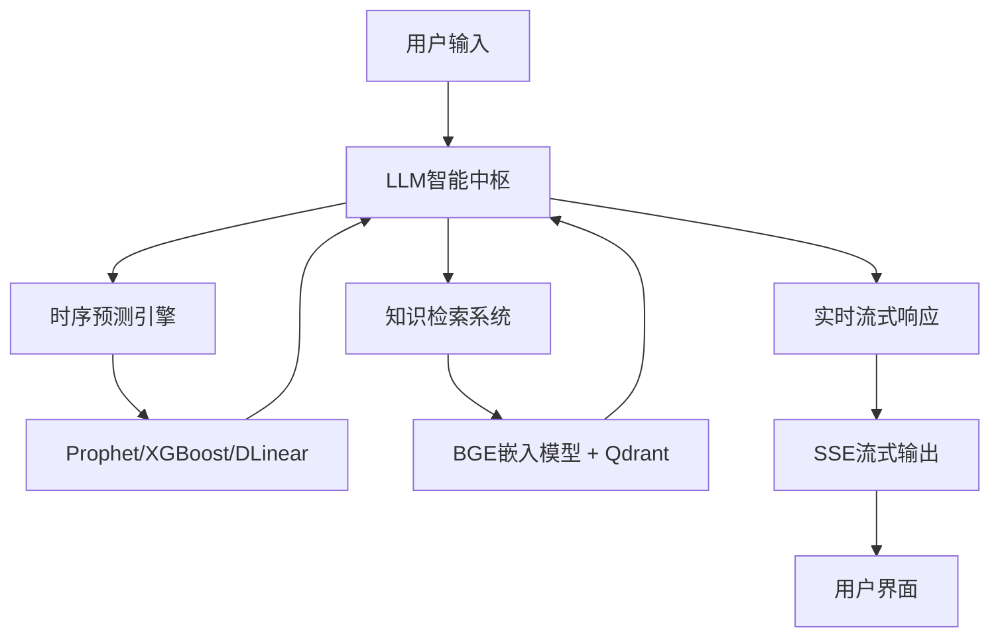

# 小易猜猜 (Xiaoyi) 🚀

<div align="center">


**Make Time Series Forecast Great Again**

*挺能猜的，也挺能说的*  
*Pretty good at forecasting, and explaining*

[](https://xiaoyi.tianyucn98.workers.dev)
[](LICENSE)
[](https://www.python.org/)
[](https://nextjs.org/)

[在线演示](https://xiaoyi.tianyucn98.workers.dev) · [技术文档](#技术架构) · [快速开始](#快速启动)

</div>

---

## 📖 项目简介

**小易猜猜 (Xiaoyi)** 是一个基于大语言模型驱动的智能时序分析与预测平台。通过结合先进的LLM调度技术、专业时序模型和知识检索系统，为时间序列数据提供深度分析、智能预测和可解释性洞察。

### 🎯 核心能力

#### 📊 **时序分析**
- **智能事件识别**：自动识别历史序列中的关键事件并进行评价
- **关键区间切分**：智能切分重要时间区间，解析态势趋势
- **自适应分析**：对历史时间序列进行深度分析，自动调整分析策略

#### 🔮 **时序预测**
- **前沿模型集成**：基于最新时间预测技术，不只是机械预报
- **预测可解释性**：更能解释预测背后的逻辑和依据
- **多模型融合**：让 LLM 能够"次预测有源可溯"

#### 💡 **智能问答**
- **实时流式响应**：类似ChatGPT的流畅对话体验
- **上下文理解**：支持多轮对话，理解历史上下文
- **知识检索增强**：结合RAG技术提供专业金融知识支持

---

## 🏗️ 技术架构

### 核心架构：LLM调度时序小模型



### 技术栈

#### 后端 (Backend)
- **核心框架**: FastAPI (Python 3.12+)
- **包管理器**: `uv` (高性能依赖管理)
- **LLM集成**: DeepSeek, LangChain
- **时序模型**: Prophet, XGBoost, DLinear
- **知识检索**: BGE嵌入 + Qdrant向量数据库
- **数据存储**: Redis (缓存), MongoDB (持久化)
- **数据来源**: AkShare (金融数据)

#### 前端 (Frontend)
- **核心框架**: Next.js 14 (React 18)
- **包管理器**: `pnpm`
- **UI框架**: Tailwind CSS, Framer Motion
- **图表可视化**: Recharts, ECharts
- **认证系统**: Authing (IDaaS)

#### 实时通信
- **SSE流式传输**: 服务端事件推送
- **Redis消息队列**: 任务异步处理

---

## 🚀 快速启动

### 环境要求

- Python >= 3.12
- Node.js >= 18
- Redis (推荐Docker运行)
- MongoDB (可选，用于持久化)

### 后端启动

```bash
# 1. 进入后端目录
cd backend

# 2. 复制并配置环境变量
cp .env.example .env
# 编辑 .env 填入 DEEPSEEK_API_KEY, MONGODB_URI, REDIS_URL 等

# 3. 安装依赖 (使用uv，极速)
uv sync

# 4. 启动开发服务器
uv run uvicorn app.main:app --host 0.0.0.0 --port 8000 --reload
```

**后端API地址**: http://localhost:8000

### 前端启动

```bash
# 1. 进入前端目录
cd frontend

# 2. 安装依赖
pnpm install

# 3. 启动开发服务器
pnpm dev
```

**前端访问地址**: http://localhost:3000

---

## 📂 项目结构

```
xiaoyi/
├── backend/                 # 后端服务
│   ├── app/
│   │   ├── agents/          # AI智能体(事件总结、建议生成等)
│   │   ├── api/             # API路由定义
│   │   │   ├── v1/          # V1版本API
│   │   │   └── v2/          # V2版本API (含用户管理)
│   │   ├── core/            # 核心配置(Config, Auth, Redis)
│   │   ├── data/            # 数据获取与处理
│   │   ├── models/          # 数据模型定义
│   │   └── services/        # 业务逻辑服务
│   ├── pyproject.toml       # Python依赖配置
│   └── Dockerfile           # Docker构建文件
│
├── frontend/                # 前端应用
│   ├── app/                 # Next.js App Router
│   │   ├── api/             # API路由(认证等)
│   │   └── page.tsx         # 主页面
│   ├── components/          # React组件
│   │   ├── chat/            # 聊天组件
│   │   ├── charts/          # 图表组件
│   │   ├── modals/          # 模态框组件
│   │   └── sidebar/         # 侧边栏组件
│   ├── context/             # React Context(认证等)
│   ├── hooks/               # 自定义Hooks
│   ├── lib/                 # 工具库
│   └── public/              # 静态资源
│
└── README.md                # 本文件
```

---

## 🎨 核心功能展示

### 1. 智能对话分析
- 流式输出，实时响应
- 多轮对话上下文理解
- 支持股票代码智能识别

### 2. 时序数据可视化
- K线图表展示
- 异常点检测与标注
- 预测区间可视化

### 3. 用户认证系统
- 基于Authing的企业级认证
- 支持邮箱/手机号登录
- 用户资料管理
- 密码安全策略

### 4. 会话管理
- 多会话支持
- 会话历史保存
- 会话重命名/删除

---

## 🔧 配置说明

### 后端环境变量 (.env)

```bash
# LLM配置
DEEPSEEK_API_KEY=your_deepseek_api_key
DEEPSEEK_BASE_URL=https://api.deepseek.com

# 数据库配置
MONGODB_URI=mongodb://localhost:27017
REDIS_URL=redis://localhost:6379

# Authing认证配置
AUTHING_APP_ID=your_app_id
AUTHING_APP_SECRET=your_app_secret
AUTHING_ISSUER=https://your-domain.authing.cn/oidc

# 服务配置
BACKEND_PORT=8000
LOG_LEVEL=INFO
```

### 前端环境变量 (.env.local)

```bash
# 后端API地址
NEXT_PUBLIC_API_URL=http://localhost:8000

# Authing配置
NEXT_PUBLIC_AUTHING_APP_ID=your_app_id
NEXT_PUBLIC_AUTHING_DOMAIN=https://your-domain.authing.cn
```

---

## 📊 性能特性

- **流式响应**: SSE技术实现秒级响应
- **智能缓存**: Redis缓存策略减少重复计算
- **异步处理**: 后台任务异步执行，提升用户体验
- **高性能依赖**: 使用uv进行极速依赖管理

---

## 🛠️ 开发指南

### 代码规范

- **Python**: 遵循PEP 8规范
- **TypeScript**: 使用ESLint + Prettier
- **提交信息**: 遵循Conventional Commits规范

### 本地调试

```bash
# 后端单元测试
cd backend
pytest

# 前端类型检查
cd frontend
pnpm type-check

# 代码格式化
pnpm format
```

---

## 🤝 研究团队

**Beihang University (BUAA)**  
ACT实验室 · SCAL小组

**指导老师**:
- 周导赫 (Haoyi Zhou)
- 陈天宇 (Tianyu Chen)

**团队成员**:
- 赵大为 (Dawei Zhao)
- 杨凯伟 (Kaiwei Yang)
- 罗智阳 (Zhiyang Luo)

---

## 📄 学术背景

本项目基于 **AAAI 2021** 最佳论文 **[Informer](https://arxiv.org/abs/2012.07436)** 的技术延伸，将长序列时间序列预测与大语言模型相结合，探索可解释AI在时序分析领域的应用。

---

## 📝 开源协议

本项目采用 [MIT License](LICENSE) 开源协议。

---

## 🔗 相关链接

- **在线演示**: https://xiaoyi.tianyucn98.workers.dev
- **GitHub**: https://github.com/Hanyu-Zhou/xiaoyi
- **联系邮箱**: hanyuc@buaa.edu.cn

---

<div align="center">

**⭐ 如果这个项目对你有帮助，欢迎 Star 支持！**

Made with ❤️ by BUAA ACT Lab & SCAL Group

</div>
