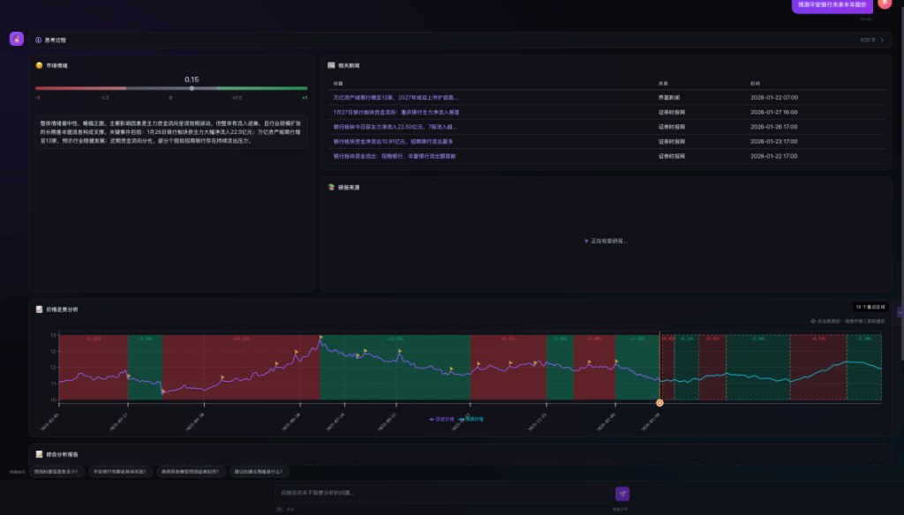

# Xiaoyi (小易猜猜) 智能金融分析平台



## 📖 项目介绍

**Xiaoyi (小易猜猜)** 是一个基于大语言模型（LLM）的智能金融分析平台。它结合了先进的 RAG（检索增强生成）技术、实时股票数据分析和多因子量化模型，为用户提供深度的市场洞察和个性化的投资建议。

核心能力包括：
- **实时市场情绪分析**：基于新闻和社交媒体数据，实时量化市场情绪。
- **智能研报检索**：通过 RAG 技术，快速检索并总结海量研报中的关键信息。
- **多因子关联分析**：深度挖掘股价与宏观经济、行业政策等因子的关联。
- **交互式预测模型**：支持如 Prophet 等模型进行股价趋势预测和回测。
- **流式对话体验**：提供类似 ChatGPT 的流畅对话体验，支持实时数据流式传输。

---

## 🛠️ 技术栈与环境配置

本项目采用前后端分离架构，注重高性能与开发体验。

### 后端 (Backend)
- **核心框架**: FastAPI (Python 3.12+)
- **包管理器**: `uv` (推荐) 或 `conda`
- **数据存储**: Redis (缓存/会话), MongoDB (持久化数据)
- **AI/LLM**: LangChain, AkShare (金融数据), Prophet (预测)

### 前端 (Frontend)
- **核心框架**: Next.js 14 (React)
- **包管理器**: `pnpm`
- **UI 组件**: Shadcn UI, Tailwind CSS
- **可视化**: Recharts, ECharts

---

## 🚀 快速启动

### 1. 环境准备
确保您的系统已安装：
- Python >= 3.12
- Node.js >= 18
- Redis & MongoDB (本地运行或 Docker)

### 2. 后端启动 (使用 uv)

推荐使用 [uv](https://github.com/astral-sh/uv) 进行极速依赖管理。

```bash
# 进入后端目录
cd backend

# 1. 复制环境变量配置
cp .env.example .env
# ⚠️ 注意：请在 .env 中填入您的 DEEPSEEK_API_KEY, MONGODB_URI, REDIS_URL 等敏感信息

# 2. 安装依赖 (使用 uv)
uv sync

# 3. 启动开发服务器
# --reload 启用热重载
uv run uvicorn app.main:app --host 0.0.0.0 --port 8000 --reload
```

*(可选) 使用 Conda 启动:*
```bash
conda create -n xiaoyi python=3.12
conda activate xiaoyi
pip install -r requirements.txt
uvicorn app.main:app --host 0.0.0.0 --port 8000 --reload
```

### 3. 前端启动 (使用 pnpm)

```bash
# 进入前端目录
cd frontend

# 1. 安装依赖
pnpm install

# 2. 启动开发服务器
pnpm run dev
```

前端访问地址: [http://localhost:3000](http://localhost:3000)

> **注意**: 前端 API 请求默认通过 Next.js Proxy (`/api` -> `http://127.0.0.1:8000`) 转发，请确保后端正常运行在 8000 端口。

---

## 📂 项目结构

### /backend (后端)
```
backend/
├── app/
│   ├── agents/          # AI 智能体 (EventSummary, Suggestion 等)
│   ├── api/             # API 路由定义 (v1, v2)
│   ├── core/            # 核心配置 (Config, Redis, Logging)
│   ├── data/            # 数据获取与处理 (AkShare, StockDB)
│   ├── models/          # 数据库模型定义 (Pydantic/ORM)
│   ├── services/        # 业务逻辑服务 (RAG, Stock Matcher)
│   └── main.py          # 程序入口
├── scripts/             # 运维与测试脚本
├── pyproject.toml       # 项目依赖配置 (uv)
└── Dockerfile           # Docker 构建文件
```

### /frontend (前端)
```
frontend/
├── app/                 # Next.js App Router 页面
├── components/          # UI 组件
│   ├── charts/          # 图表组件 (K线, 预测图)
│   └── ui/              # 基础 UI 组件 (Button, Card 等)
├── lib/                 # 工具库
│   ├── api/             # API 客户端封装
│   └── utils/           # 通用工具函数
├── hooks/               # React Hooks (useSessionManager 等)
├── public/              # 静态资源
└── next.config.js       # Next.js 配置 (含 Proxy)
```
