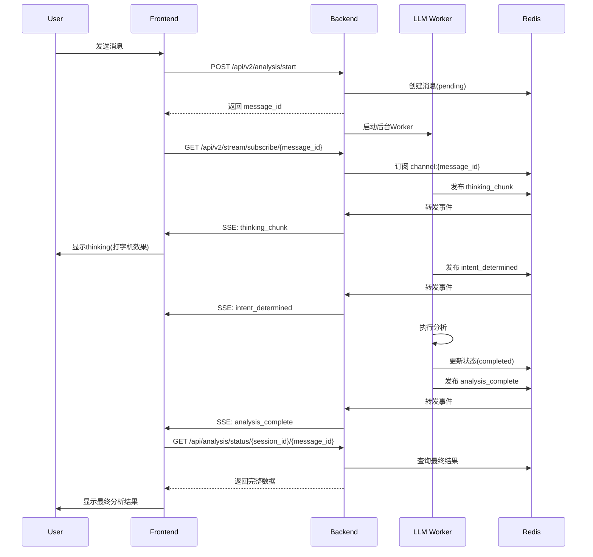
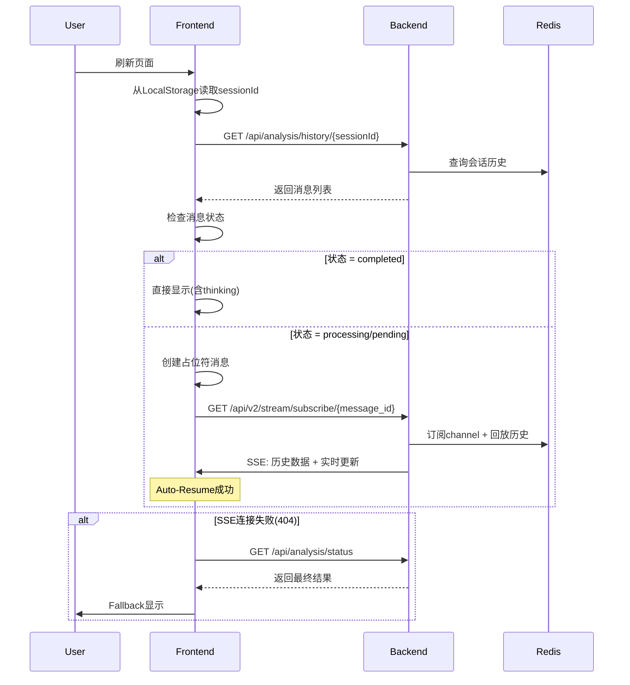

# 小易智能分析系统 - 消息处理与断线重连技术文档

> **版本**: v2.0  
> **更新日期**: 2026-01-18  
> **适用场景**: 项目交接、新开发者入门、系统维护

---

## 📋 目录

1. [架构概览](#架构概览)
2. [核心流程](#核心流程)
3. [前端实现](#前端实现)
4. [后端实现](#后端实现)
5. [断线重连机制](#断线重连机制)
6. [数据结构](#数据结构)
7. [关键组件](#关键组件)
8. [常见问题](#常见问题)
9. [未来优化](#未来优化)

---

## 架构概览

### 整体架构

```
┌─────────────┐        ┌──────────────┐        ┌─────────────┐
│   Frontend  │◄──────►│    Backend   │◄──────►│    Redis    │
│  (Next.js)  │  SSE   │   (FastAPI)  │ Pub/Sub│   Channel   │
└─────────────┘        └──────────────┘        └─────────────┘
       │                       │
       │                       ▼
       │               ┌──────────────┐
       │               │  LLM Worker  │
       │               │  (Background)│
       │               └──────────────┘
       │
       ▼
 ┌──────────────┐
 │  LocalStorage│
 │  (SessionID) │
 └──────────────┘
```

### 技术栈

**Frontend**:
- Next.js 14 (App Router)
- TypeScript
- EventSource API (SSE)
- LocalStorage (会话持久化)

**Backend**:
- FastAPI
- Redis (Pub/Sub + State Storage)
- Asyncio (异步任务)
- Pydantic (数据验证)

### 设计原则

1. **解耦**: LLM生成与SSE传输完全解耦，后台任务独立于前端连接
2. **持久化**: 使用Redis存储消息状态和思考内容
3. **弹性**: 支持刷新、断线重连，无缝恢复
4. **实时性**: 基于SSE的实时流式传输

---

## 核心流程

### 1. 完整消息流程



### 2. 刷新恢复流程



---

## 前端实现

### 关键文件

```
frontend/
├── components/chat/
│   ├── ChatArea.tsx           # 主聊天组件(核心逻辑)
│   ├── MessageBubble.tsx      # 消息气泡
│   ├── ThinkingSection.tsx    # 思考过程显示
│   └── MessageContent.tsx     # 内容渲染
├── lib/api/
│   └── analysis.ts            # API封装
└── types/
    └── message.ts             # 类型定义
```

### ChatArea.tsx 核心逻辑

#### 1. 发送消息 (handleSend)

```typescript
const handleSend = async () => {
  // Step 1: 创建用户消息
  const userMessage = { ... }
  setMessages(prev => [...prev, userMessage])
  
  // Step 2: 触发后台Worker
  const response = await fetch('/api/v2/analysis/start?...')
  const { message_id } = await response.json()
  
  // Step 3: 创建Assistant占位符(thinking模式)
  const assistantMessage = {
    id: `assistant-${message_id}`,
    role: 'assistant',
    renderMode: 'thinking',
    thinkingContent: ''
  }
  setMessages(prev => [...prev, assistantMessage])
  
  // Step 4: 订阅SSE流
  const eventSource = new EventSource(`/api/v2/stream/subscribe/${message_id}?...`)
  
  // Step 5: 监听事件
  eventSource.addEventListener('thinking_chunk', (event) => {
    const { accumulated } = JSON.parse(event.data)
    setMessages(prev => prev.map(msg => 
      msg.id === assistantMessageId 
        ? { ...msg, thinkingContent: accumulated }
        : msg
    ))
  })
  
  eventSource.addEventListener('analysis_complete', async () => {
    eventSource.close()
    // 获取最终结果（无需reload）
    const finalResult = await getAnalysisStatus(...)
    setMessages(prev => prev.map(msg => 
      msg.id === assistantMessageId
        ? { ...msg, contents: [...], renderMode: '...' }
        : msg
    ))
  })
}
```

#### 2. 断线重连 (loadSessionHistory)

```typescript
useEffect(() => {
  const loadSessionHistory = async () => {
    // 1. 获取会话历史
    const history = await getSessionHistory(sessionId)
    
    // 2. 转换为前端Message格式
    const loadedMessages = []
    let processingMessageId = null
    let processingSessionId = null
    
    for (const historyMsg of history.messages) {
      if (historyMsg.status === 'completed') {
        // 完成的消息：直接显示
        loadedMessages.push({
          ...convertToMessage(historyMsg),
          thinkingContent: historyMsg.data.thinking_content // ✅ 保留thinking
        })
      } else if (historyMsg.status === 'processing' || historyMsg.status === 'pending') {
        // 未完成的消息：记录ID，准备重连
        processingMessageId = historyMsg.message_id
        processingSessionId = historyMsg.data.session_id
        loadedMessages.push({
          id: `assistant-${historyMsg.message_id}`,
          renderMode: 'thinking',
          thinkingContent: historyMsg.data?.thinking_content || ''
        })
      }
    }
    
    setMessages(loadedMessages)
    
    // 3. Auto-Resume: 重连SSE
    if (processingMessageId && processingSessionId) {
      const eventSource = new EventSource(`/api/v2/stream/subscribe/${processingMessageId}?...`)
      
      // 监听事件（同handleSend）
      eventSource.addEventListener('thinking_chunk', ...)
      eventSource.addEventListener('analysis_complete', ...)
      
      // ✅ Fallback: SSE失败时获取最终结果
      eventSource.onerror = async () => {
        eventSource.close()
        const finalResult = await getAnalysisStatus(...)
        if (finalResult.status === 'completed') {
          setMessages(prev => prev.map(...))  // 更新为最终结果
        }
      }
    }
  }
  
  loadSessionHistory()
}, [sessionId])
```

### ThinkingSection.tsx

```typescript
export function ThinkingSection({ content, isLoading }) {
  const [isExpanded, setIsExpanded] = useState(true) // ✅ 默认展开
  
  if (!content && !isLoading) return null
  
  return (
    <div className="glass rounded-xl">
      <button onClick={() => setIsExpanded(!isExpanded)}>
        {isLoading ? '思考中...' : '思考过程'}
      </button>
      {isExpanded && (
        <div className="whitespace-pre-wrap">{content}</div>
      )}
    </div>
  )
}
```

### 状态管理

```typescript
// Message类型
interface Message {
  id: string
  role: 'user' | 'assistant'
  text?: string  // 用户消息
  timestamp: string
  
  // Assistant消息特有
  renderMode?: 'thinking' | 'chat' | 'forecast'
  thinkingContent?: string  // 思考内容
  contents?: Content[]       // 最终内容
  steps?: Step[]             // 步骤(forecast模式)
}

// 会话状态
- sessionId: 保存在LocalStorage，用于历史恢复
- messages: 当前会话所有消息
- isLoading: 加载状态
```

---

## 后端实现

### 关键文件

```
backend/
├── app/
│   ├── api/v2/endpoints/
│   │   ├── analysis_trigger.py    # 触发分析
│   │   └── sse_subscribe.py       # SSE订阅
│   ├── workers/
│   │   └── llm_worker.py          # 后台Worker
│   ├── core/sse/
│   │   ├── state_manager.py       # 状态管理
│   │   └── redis_pubsub.py        # Redis Pub/Sub封装
│   └── services/
│       └── streaming_analysis.py  # 流式分析服务
```

### API端点

#### POST /api/v2/analysis/start

**触发后台分析任务**

```python
@router.post("/analysis/start")
async def start_analysis(
    message: str,
    session_id: str,
    model: str,
    background_tasks: BackgroundTasks
):
    # 1. 创建消息记录
    msg = Message(
        message_id=str(uuid.uuid4()),
        session_id=session_id,
        user_query=message,
        status='pending'
    )
    save_message(msg)
    
    # 2. 启动后台Worker（不等待）
    background_tasks.add_task(
        llm_generation_worker,
        session_id=session_id,
        message_id=msg.message_id,
        user_query=message,
        model=model
    )
    
    # 3. 立即返回
    return {
        "message_id": msg.message_id,
        "status": "pending"
    }
```

#### GET /api/v2/stream/subscribe/{message_id}

**SSE订阅端点**

```python
@router.get("/stream/subscribe/{message_id}")
async def subscribe_stream(
    message_id: str,
    session_id: str
):
    async def event_generator():
        # 1. 回放历史数据（如果有）
        buffer = await state_manager.get_full_buffer(message_id)
        if buffer and buffer.get('thinking'):
            yield f"data: {json.dumps({'accumulated': buffer['thinking']})}\n\n"
        
        # 2. 订阅Redis Pub/Sub
        channel = f"channel:{message_id}"
        async for event in redis_pubsub.subscribe(channel):
            event_type = event.get('type')
            
            if event_type == 'thinking_chunk':
                yield f"event: thinking_chunk\ndata: {json.dumps(event['data'])}\n\n"
            elif event_type == 'intent_determined':
                yield f"event: intent_determined\ndata: {json.dumps(event['data'])}\n\n"
            elif event_type == 'analysis_complete':
                yield f"event: analysis_complete\ndata: {{}}\n\n"
                break
    
    return StreamingResponse(
        event_generator(),
        media_type="text/event-stream"
    )
```

#### GET /api/analysis/history/{session_id}

**获取会话历史**

```python
@router.get("/analysis/history/{session_id}")
async def get_session_history(session_id: str):
    session = get_session(session_id)
    if not session:
        raise HTTPException(404, "Session not found")
    
    messages = []
    for msg in session.messages:
        # ✅ 包含thinking_content字段
        messages.append({
            "message_id": msg.message_id,
            "user_query": msg.user_query,
            "status": msg.status,
            "data": {
                ...msg.data,
                "thinking_content": msg.thinking_content,  # 关键！
                "session_id": session_id
            }
        })
    
    return {
        "session_id": session_id,
        "messages": messages
    }
```

### LLM Worker (llm_worker.py)

```python
def llm_generation_worker(session_id, message_id, user_query, model):
    """
    后台Worker - 独立于SSE连接运行
    """
    loop = get_or_create_event_loop()
    
    # 1. Intent Recognition (流式)
    async def run_intent():
        intent_result = await intent_agent.recognize_intent_stream(
            query=user_query,
            publisher=create_redis_publisher(message_id)  # 发布到Redis
        )
        
        # 保存thinking到buffer和数据库
        await state_manager.update_buffer(
            message_id,
            thinking=intent_result.thinking_content,
            intent=intent_result.intent
        )
        save_thinking_to_db(message_id, intent_result.thinking_content)
        
        # 发布intent_determined事件
        await redis_pubsub.publish(f"channel:{message_id}", {
            'type': 'intent_determined',
            'data': {'intent': intent_result.intent, ...}
        })
        
        return intent_result
    
    intent = loop.run_until_complete(run_intent())
    
    # 2. Execute Remaining Analysis (后台运行)
    if intent.is_in_scope:
        # ✅ 即使SSE断开，这里也会继续执行
        loop.run_until_complete(
            execute_remaining_analysis(
                session_id=session_id,
                message_id=message_id,
                intent=intent,
                publisher=None  # TODO: Phase 2 - 添加publisher
            )
        )
    
    # 3. 发布完成事件
    loop.run_until_complete(
        redis_pubsub.publish(f"channel:{message_id}", {
            'type': 'analysis_complete',
            'data': {}
        })
    )
```

### Redis Pub/Sub Manager

```python
class RedisPubSubManager:
    def __init__(self):
        self.redis = redis.Redis(decode_responses=True)
    
    async def publish(self, channel: str, data: dict):
        """发布事件到channel"""
        self.redis.publish(channel, json.dumps(data))
    
    async def subscribe(self, channel: str):
        """订阅channel并yield事件"""
        pubsub = self.redis.pubsub()
        pubsub.subscribe(channel)
        
        try:
            for message in pubsub.listen():
                if message['type'] == 'message':
                    yield json.loads(message['data'])
        finally:
            pubsub.close()
```

### State Manager

```python
class SSEStateManager:
    async def update_buffer(self, message_id: str, **kwargs):
        """更新消息buffer（用于历史回放）"""
        key = f"msg_buffer:{message_id}"
        
        buffer = self.redis.hgetall(key) or {}
        buffer.update(kwargs)
        
        self.redis.hset(key, mapping=buffer)
        self.redis.expire(key, 3600)  # 1小时过期
    
    async def get_full_buffer(self, message_id: str):
        """获取完整buffer"""
        key = f"msg_buffer:{message_id}"
        return self.redis.hgetall(key)
```

---

## 断线重连机制

### 核心思想

**目标**: 无论何时刷新，用户都能看到当前状态并无缝恢复

**实现策略**:
1. **状态持久化**: 所有关键状态存储在Redis
2. **历史回放**: SSE重连时先回放历史数据
3. **智能检测**: Frontend根据消息状态决定如何处理
4. **Fallback机制**: SSE失败时降级到API轮询

### 三种状态处理

#### 1. Completed (已完成)

```
刷新 → 加载历史 → status=completed
     ↓
直接显示最终结果 + thinking内容
```

**Frontend**:
```typescript
if (historyMsg.status === 'completed') {
  loadedMessages.push({
    ...convertMessage(historyMsg),
    thinkingContent: historyMsg.data.thinking_content  // ✅ 保留thinking
  })
}
```

#### 2. Processing (进行中)

```
刷新 → 加载历史 → status=processing
     ↓
创建占位符 → 重连SSE → 继续接收更新
     ↓
(如果SSE 404) → Fallback获取最终结果
```

**Frontend**:
```typescript
if (historyMsg.status === 'processing') {
  processingMessageId = historyMsg.message_id
  processingSessionId = historyMsg.data.session_id
  
  // 创建占位符
  loadedMessages.push({
    id: `assistant-${historyMsg.message_id}`,
    renderMode: 'thinking',
    thinkingContent: historyMsg.data.thinking_content || ''
  })
}

// 重连SSE
if (processingMessageId) {
  const eventSource = new EventSource(...)
  eventSource.onerror = async () => {
    // Fallback
    const result = await getAnalysisStatus(...)
    if (result.status === 'completed') {
      setMessages(prev => prev.map(...))
    }
  }
}
```

#### 3. Pending (待处理)

```
刷新 → 加载历史 → status=pending
     ↓
创建占位符 → 重连SSE → 等待Worker启动 → 接收更新
```

**处理方式与Processing相同**

### SSE 历史回放

**Backend** (`sse_subscribe.py`):
```python
async def event_generator():
    # Step 1: 回放历史thinking
    buffer = await state_manager.get_full_buffer(message_id)
    if buffer and buffer.get('thinking'):
        # 一次性发送累积的thinking
        yield f"event: thinking_chunk\ndata: {json.dumps({
            'accumulated': buffer['thinking']
        })}\n\n"
    
    # Step 2: 订阅实时更新
    async for event in redis_pubsub.subscribe(f"channel:{message_id}"):
        # 转发实时事件
        yield format_sse_event(event)
```

### Fallback机制

**触发条件**:
- SSE连接失败(404, 网络错误等)
- Channel已关闭(分析已完成)

**Fallback逻辑**:
```typescript
eventSource.onerror = async () => {
  eventSource.close()
  
  try {
    // 尝试获取最终结果
    const finalResult = await getAnalysisStatus(sessionId, messageId)
    
    if (finalResult.status === 'completed') {
      // 更新为最终状态
      setMessages(prev => prev.map(msg =>
        msg.id === assistantMessageId
          ? {
              ...msg,
              contents: finalResult.data.conclusion,
              renderMode: finalResult.data.is_forecast ? 'forecast' : 'chat',
              thinkingContent: finalResult.data.thinking_content
            }
          : msg
      ))
    }
  } catch (error) {
    console.error('Fallback failed:', error)
  }
}
```

---

## 数据结构

### Frontend Message

```typescript
interface Message {
  id: string                    // 消息唯一ID
  role: 'user' | 'assistant'
  timestamp: string
  
  // User消息
  text?: string
  
  // Assistant消息
  renderMode?: 'thinking' | 'chat' | 'forecast'
  thinkingContent?: string      // Markdown格式的思考过程
  contents?: Content[]          // 最终内容(文本/图表/表格)
  steps?: Step[]               // 分析步骤(forecast)
  intentInfo?: IntentInfo      // 意图信息
}
```

### Backend Message (数据库)

```python
class Message:
    message_id: str
    session_id: str
    user_query: str
    
    status: Literal['pending', 'processing', 'completed', 'error']
    thinking_content: str       # 思考过程(持久化)
    
    # MessageData
    data: MessageData           # 完整分析结果
```

### Redis Buffer

```
Key: msg_buffer:{message_id}
Type: Hash
Fields:
  - thinking: str             # 累积的thinking内容
  - intent: str               # 意图
  - steps: int               # 当前步骤数
  - conclusion: str          # 最终结论(可选)
TTL: 3600秒
```

### SSE Event格式

```
event: thinking_chunk
data: {"chunk": "新增内容", "accumulated": "累积内容"}

event: intent_determined  
data: {"intent": "chat", "is_forecast": false, ...}

event: analysis_complete
data: {}
```

---

## 关键组件

### 1. EventSource (Frontend)

```typescript
const eventSource = new EventSource(url)

// 监听自定义事件
eventSource.addEventListener('thinking_chunk', (event) => {
  const data = JSON.parse(event.data)
  // 处理
})

// 监听连接状态
eventSource.onopen = () => console.log('Connected')
eventSource.onerror = () => console.error('Error')

// 关闭连接
eventSource.close()
```

**注意事项**:
- 自动重连：浏览器会自动重连，但Backend可能已关闭channel
- 跨域：需要CORS配置
- 超时：长时间无数据可能触发onerror

### 2. Redis Pub/Sub

```python
# 发布
redis.publish('channel:123', json.dumps({'type': 'event', 'data': {...}}))

# 订阅
pubsub = redis.pubsub()
pubsub.subscribe('channel:123')
for message in pubsub.listen():
    if message['type'] == 'message':
        data = json.loads(message['data'])
        # 处理
```

**注意事项**:
- 消息不持久化：未订阅时的消息会丢失
- 需要buffer：用Redis Hash存储历史数据
- Channel生命周期：分析完成后手动取消订阅

### 3. BackgroundTasks (FastAPI)

```python
@app.post("/start")
async def start(background_tasks: BackgroundTasks):
    background_tasks.add_task(long_running_task, arg1, arg2)
    return {"status": "started"}  # 立即返回

def long_running_task(arg1, arg2):
    # 在后台运行，不阻塞响应
    # ✅ 即使客户端断开，也会继续执行
    pass
```

---

## 常见问题

### Q1: 刷新后thinking不显示？

**原因**: 
- HistoryMessage没有thinking_content字段
- Frontend没有从data中提取

**解决**:
```typescript
// ✅ 正确
thinkingContent: historyMsg.data?.thinking_content || ''

// ❌ 错误
thinkingContent: historyMsg.thinking_content  // 字段不存在
```

### Q2: 刷新后卡住，不显示结果？

**原因**:
- SSE重连失败(404)，没有fallback
- Backend分析已完成，channel已关闭

**解决**:
```typescript
eventSource.onerror = async () => {
  // ✅ 添加fallback
  const result = await getAnalysisStatus(...)
  if (result.status === 'completed') {
    // 更新UI
  }
}
```

### Q3: ThinkingSection默认折叠？

**原因**: `useState(false)`

**解决**:
```typescript
const [isExpanded, setIsExpanded] = useState(true)  // ✅ 默认展开
```

### Q4: 多次刷新导致重复订阅？

**原因**: React严格模式或useEffect依赖问题

**解决**:
```typescript
useEffect(() => {
  if (historyLoadedRef.current) return  // ✅ 防重复
  historyLoadedRef.current = true
  
  loadSessionHistory()
}, [sessionId])
```

### Q5: SSE事件格式错误？

**正确格式**:
```
event: event_name\n
data: {"key": "value"}\n
\n
```

**错误示例**:
```python
# ❌ 错误
yield json.dumps({'event': 'thinking_chunk', 'data': {...}})

# ✅ 正确
yield f"event: thinking_chunk\ndata: {json.dumps({...})}\n\n"
```

---

## 未来优化

### Phase 2: Analysis流式推送 (TODO)

**当前问题**: `execute_remaining_analysis`不发布事件，前端不知道分析进度

**优化方案**:
```python
async def execute_remaining_analysis(
    message_id: str,
    publisher: PublisherType  # ✅ 添加publisher参数
):
    # 发布步骤更新
    await publisher.publish({
        'type': 'step_update',
        'data': {'step': 2, 'status': 'running', 'message': '检索中...'}
    })
    
    # 发布分析内容chunk
    await publisher.publish({
        'type': 'analysis_chunk',
        'data': {'chunk': '根据检索结果...'}
    })
```

**Frontend**:
```typescript
eventSource.addEventListener('step_update', (event) => {
  const { step, status, message } = JSON.parse(event.data)
  // 更新步骤UI
})

eventSource.addEventListener('analysis_chunk', (event) => {
  const { chunk } = JSON.parse(event.data)
  // 显示分析过程
})
```

### Phase 4: Redis数据结构优化

**当前**: 使用Redis Hash存储buffer

**优化**: 考虑使用Redis Streams
- 自然支持消息历史
- 消费者组支持多客户端
- 更好的持久化和回放

### 性能优化

1. **SSE连接池**: 限制单个session的最大连接数
2. **Buffer清理**: 定时清理过期buffer
3. **前端节流**: thinking更新太频繁时节流渲染
4. **懒加载**: 历史消息分页加载

---

## 附录

### 环境变量

```bash
# Backend
REDIS_HOST=localhost
REDIS_PORT=6379
API_KEY=your-llm-api-key

# Frontend
NEXT_PUBLIC_API_URL=http://localhost:8000
```

### 调试技巧

1. **查看SSE事件**:
```typescript
eventSource.addEventListener('thinking_chunk', (event) => {
  console.log('[SSE]', event.type, JSON.parse(event.data))
})
```

2. **查看Redis Pub/Sub**:
```bash
redis-cli
SUBSCRIBE channel:message-id-123
```

3. **查看Buffer**:
```bash
redis-cli
HGETALL msg_buffer:message-id-123
```

4. **Backend日志**:
```python
logger.info(f"[SSE Subscribe] Received event: {event['type']}")
```

### 相关文档

- [SSE规范](https://html.spec.whatwg.org/multipage/server-sent-events.html)
- [Redis Pub/Sub](https://redis.io/docs/interact/pubsub/)
- [FastAPI BackgroundTasks](https://fastapi.tiangolo.com/tutorial/background-tasks/)

---

**最后更新**: 2026-01-18  
**作者**: Antigravity  
**审核**: [待补充]
